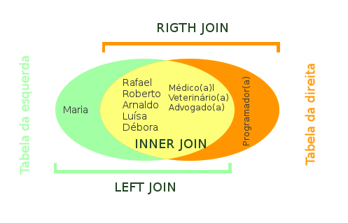

Há uns 15 anos, quando comecei a trabalhar como programador, tive meu primeiro contato com o SQL. Na época utilizava o visual basic e não me lembro o nome do banco de dados. Mas não me esqueço dos enormes códigos sqls com a qual tinha que lidar.

Na época eu utilizava apenas a cláusula "where" para fazer a junção das tabelas. Eu até já tinha me deparado com o ‘join’, porém para ser sincero, ele me dava medo(rs). Parecia ser algo muito complicado.

A verdade é que complicado mesmo era a forma que eu fazia. Se eu tivesse parado e estudado os ‘joins’ provavelmente teria poupado muito tempo e dor de cabeça.

Então para evitar que isso aconteça com mais pessoas resolvi escrever esse artigo tentando simplificar ao máximo como esses comandos mágicos funcionam.

## Entendendo o JOIN
Basicamente existem 3 tipos de join: inner, left, right. Existem outros como full outer join e cross join, mas são pouco usados e não passam de implementações desses três básicos. Como o objetivo deste artigo é simplificar a explicação, vou deixa-los de fora.

Pode não parecer num primeiro momento, mas a lógica do Join é muito simples. Imagine o código SQL como 2 tabelas. Uma(da esquerda ou left) antes do JOIN e outra(da direita ou right) depois dele. É algo mais ou menos assim:

> Tabela da esquerda JOIN Tabela da direita ON "campo em comum"
O “campo em comum” é o campo da tabela que faz a ligação entre as duas, ou seja, é o campo chave.

## O banco de dados

Antes de começar a explicar como funciona cada um dos joins criei duas tabelas servirem de exemplo:

### Tabela da esquerda

| Nome    | id_profissao |
|---------|--------------|
| Rafael  | 1            |
| Roberto | 2            |
| Arnaldo | 3            |
| Luísa   | 1            |
| Débora  | 2            |
| Maria   | 0            |

```
CREATE TABLE `tabela_esquerda` (`nome` VARCHAR(50) NOT NULL, `id_profissao` INT(1) NOT NULL);

INSERT INTO `tabela_esquerda` (`nome`,`id_profissao`) VALUES ('Rafael','1'),('Roberto','2'),('Arnaldo','3'),('Luísa','1'),('Débora','2'),('Maria','0');
```

### Tabela da direita

| id_profissao | Profissão      |
|--------------|----------------|
| 1            | Médico(a)      |
| 2            | Veterinário(a) |
| 3            | Advogado(a)    |
| 4            | Programador    |

```
CREATE TABLE `tabela_direita` (`id_profissao` INT(1) NOT NULL, `profissao` VARCHAR(50) NOT NULL);

INSERT INTO `tabela_direita` (`id_profissao`,`profissao`) VALUES ('1','Médico(a)'),('2','Veterinário(a)'),('3','Advogado(a)'),('4','Programador')
```

Repare que o “Campo em comum” nas tabelas é a coluna “id_profissão”.

## Inner join

Basicamente, ele verifica todos os campos em comum entre as duas tabelas e exibe como uma única. Nosso código sql para o inner join é assim:

### Código SQL
```
select * from tabela_esquerda INNER JOIN tabela_direita on tabela_esquerda.id_profissao = tabela_direita.id_profissao
```
ou
```
select * from tabela_esquerda JOIN tabela_direita on tabela_esquerda.id_profissao = tabela_direita.id_profissao
```

### Resultado

| nome    | id_profissao | id_profissao | profissao      |
|---------|--------------|--------------|----------------|
| Rafael  | 1            | 1            | Médico(a)      |
| Roberto | 2            | 2            | Veterinário(a) |
| Arnaldo | 3            | 3            | Advogado(a)    |
| Luísa   | 1            | 1            | Médico(a)      |
| Débora  | 2            | 2            | Veterinário(a) |

Como podemos observar, o banco de dados retornou apenas as linhas que tinham o campo ‘id_profissao’ em comum nas duas tabelas. Como nenhum nome da tabela_esquerda estava relacionado a profissão ‘programador’ da tabela_direita, esta profissão não foi exibida no resultado. Assim como aconteceu com o nome “Maria”, que também não estava ligada a uma profissão.

## Left Join

O left join ou Left outer join também relaciona as duas tabelas, porém ele vai exibir todas as linhas contidas na tabela da esquerda, não importando se campo ‘id_profissão’ existe na tabela_direita.

### Código SQL
```
select * from tabela_esquerda LEFT JOIN tabela_direita on tabela_esquerda.id_profissao = tabela_direita.id_profissao
```

### resultado

| nome    | id_profissao | id_profissao | profissao      |
|---------|--------------|--------------|----------------|
| Rafael  | 1            | 1            | Médico(a)      |
| Luísa   | 1            | 1            | Médico(a)      |
| Roberto | 2            | 2            | Veterinário(a) |
| Débora  | 2            | 2            | Veterinário(a) |
| Arnaldo | 3            | 3            | Advogado(a)    |
| Maria   | 0            | NULL         | NULL           |

Como podemos observar, desta vez a linha com o nome “Maria” foi exibido com um valor null para a coluna profissão. Essa é a diferença para o ‘INNER JOIN’, mesmo sem um campo correspondente na tabela da direita o valor é exibido.

## Right join

Funciona da mesma forma que o LEFT JOIN, porém agora o banco de dados leva em conta apenas a tabela que está a direita do JOIN.

### Código SQL
```
select * from tabela_esquerda RIGHT JOIN tabela_direita on tabela_esquerda.id_profissao = tabela_direita.id_profissao
```

### Resultado

| nome    | id_profissao | id_profissao | profissao      |
|---------|--------------|--------------|----------------|
| Rafael  | 1            | 1            | Médico(a)      |
| Roberto | 2            | 2            | Veterinário(a) |
| Arnaldo | 3            | 3            | Advogado(a)    |
| Luísa   | 1            | 1            | Médico(a)      |
| Débora  | 2            | 2            | Veterinário(a) |
| NULL    | NULL         | 4            | Programador    |

Observe que desta vez a profissão “Programador” foi exibida, mesmo não tendo nenhum nome relacionado a ela. O nome ‘Maria’ foi omitido, pois somente os campos da tabela da direita são levados em consideração.

## Conclusão

Como podemos observar o join não é nenhum bicho de 7 cabeças. É até simples quando entendemos a lógica.
Para entender ainda melhor elaborei um pequeno gráfico como ilustração do conceito.



Espero que esta breve explicação tenha ajudado de alguma forma a entender como o join realmente funciona. É sempre bom lembrar que nada melhor que a prática para entender a fundo alguma coisa. Então mãos a obra. Não deixe de testar os exemplos demonstrados aqui.


